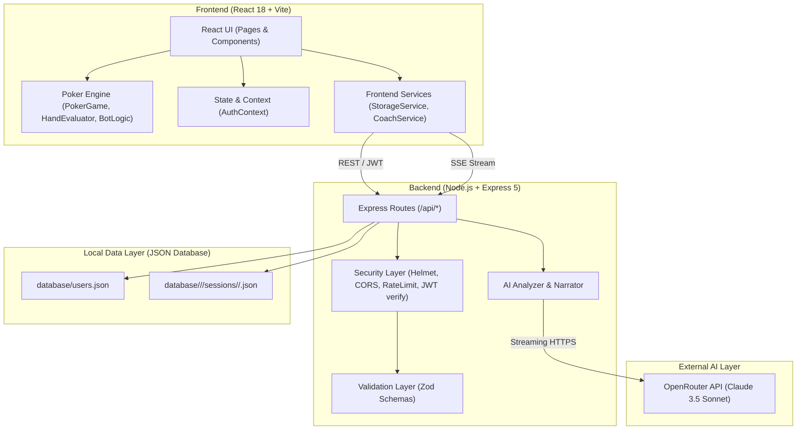

# Technical Architecture (ARCHITECTURE.md) — Poker Analytics Engine

This document defines the system architecture, directory roles, data flow, security model, and component interactions of the Poker Analytics Engine.

---

## 1. System Architecture Diagram



---

## 2. Directory Structure & Key Responsibilities

```
Poker App/
├── .agents/                    # Solo Dev Kit cognitive environment
│   ├── blueprint/              # Single source of truth (PRD, ARCHITECTURE, etc.)
│   ├── rules/                  # Engineering rules & constraints
│   └── skills/                 # 17 domain & lifecycle agent skills
├── database/                   # Local file-based JSON database
│   ├── users.json              # Registered user credentials & profile data
│   └── <username>/             # Per-user segregated storage
│       ├── cash/sessions/      # Cash game sessions and hand records
│       └── tournament/sessions/# Tournament sessions and hand records
├── server/                     # Backend API & AI orchestration
│   ├── server.js               # Express application entry, routes & middleware
│   └── services/
│       ├── AIAnalyzer.js       # Pre-computed facts assembly & coaching prompts
│       ├── HandAnalyzer.js     # Mathematical player profiling & stats classifier
│       ├── HandNarrator.js     # Natural-language hand summarizer for LLM
│       └── OpenRouterService.js# SSE streaming connection to OpenRouter API
├── src/                        # Frontend React Application
│   ├── App.tsx                 # Route declarations & PrivateRoute guard
│   ├── main.tsx                # React DOM root mounting
│   ├── index.css               # Tailwind directives, animations & custom sliders
│   ├── components/             # Reusable UI widgets
│   │   ├── Card.tsx            # Playing card render with suit/rank styling
│   │   ├── Controls.tsx        # Fold/Check/Call/Raise action bar & sizing sliders
│   │   ├── PokerTable.tsx      # Felt table canvas with seat positions & chip pots
│   │   ├── Seat.tsx            # Individual player seat with HUD stats & avatar
│   │   ├── SessionDashboard.tsx# In-game live stats popup overlay
│   │   ├── ShowdownOverlay.tsx # Winning hand announcement banner
│   │   ├── GameOverScreen.tsx  # Bust-out / cashout summary view
│   │   └── PositionalStatsTable.tsx # Positional stats matrix display
│   ├── context/
│   │   └── AuthContext.tsx     # JWT token lifecycle, login/logout state
│   ├── game/                   # Core deterministic poker engine
│   │   ├── Deck.ts             # 52-card deck generator and fisher-yates shuffle
│   │   ├── HandEvaluator.ts    # 7-card evaluator, hand rankings, kickers
│   │   ├── PokerGame.ts        # Turn management, betting rounds, pot splitting
│   │   ├── BotLogic.ts         # GTO/exploitative bot decision matrices
│   │   ├── OpponentProfiler.ts # Dynamic tracking of opponent tendencies
│   │   ├── ShowdownResolver.ts # Side pot and winner equity calculation
│   │   ├── TournamentManager.ts# Blind levels, multi-table balancing, MTT clock
│   │   └── types.ts            # Core TypeScript models & interfaces
│   ├── hooks/
│   │   ├── useBotTurn.ts       # Asynchronous delay and action execution for bots
│   │   └── useHandProgression.ts# Countdown timer & transition between hands
│   ├── pages/
│   │   ├── HomePage.tsx        # Game mode lobby & quick statistics overview
│   │   ├── GamePage.tsx        # Active table interface (Cash/MTT)
│   │   ├── StatisticsPage.tsx  # Deep lifetime analytics, graphs & leak indicators
│   │   ├── CoachPage.tsx       # AI Coach chat interface & quick action triggers
│   │   ├── ImportPage.tsx      # PokerStars hand history file parser
│   │   └── LoginPage.tsx       # User authentication & registration
│   ├── services/
│   │   ├── StorageService.ts   # Client-side API wrapper for sessions & hands
│   │   └── CoachService.ts     # Client-side SSE stream receiver for AI chat
│   └── utils/
│       ├── HandHistoryParser.ts# RegEx parser for PokerStars raw hand logs
│       └── SoundManager.ts     # Web Audio API procedural card/chip sound generator
└── package.json                # Dependencies, scripts and tools
```

---

## 3. Data Flow & Communication Lifecycle

### 3.1 Gameplay & Hand Storage Flow
1. User configures table parameters on `HomePage` (`/play?mode=cash&difficulty=advanced`).
2. `GamePage` instantiates `PokerGame` instance locally in browser memory.
3. Betting rounds (Pre-flop, Flop, Turn, River) execute in client-side state machine.
4. When a hand concludes, `PokerGame` computes showdown ranks, awards pots, and emits a structured `SavedHand` record.
5. Hands accumulate in memory and are periodically batch-saved via `StorageService.saveHand()` to `POST /api/hands`.
6. Server saves hands inside `database/<username>/<mode>/sessions/<DDMMYYYY>/<sessionId>.json`.

### 3.2 AI Coaching & Pre-Computation Flow
1. User requests **Session Review** or **Global Leak Finder** on `CoachPage`.
2. Backend pulls the corresponding session JSON files from `database/`.
3. `HandAnalyzer.js` and `HandNarrator.js` compute mathematical facts deterministically (VPIP, PFR, 3-bet frequency, steal%, board texture, hero holdings).
4. `AIAnalyzer.js` constructs a structured fact payload and builds a system prompt instructing the LLM to follow the verified numbers without hallucinating.
5. `OpenRouterService.js` streams the token output via HTTP SSE directly to the React frontend UI.

---

## 4. Security & Quality Assessment

1. **Authentication**: JWT token storage in `localStorage`.
   - *Risk*: Plaintext password storage in `database/users.json`. Needs migration to `bcrypt` or `argon2`.
   - *Risk*: `JWT_SECRET` defaults to a dev fallback string if not present in `.env`.
2. **API Protection**:
   - `helmet` applied for secure HTTP headers.
   - `cors` configured for `http://localhost:5173`.
   - `express-rate-limit` active on auth and coach endpoints.
   - Directory traversal protection on session deletion using username verification checks.
3. **TypeScript Type Safety**:
   - High coverage in `src/game/`.
   - One compile error in `StorageService.ts:96` (`userId` unused param) failing `npm run build`.

---

## 5. Planned Architectural Refactoring
1. **Security Hardening**:
   - Hash passwords with `bcrypt` upon registration and verify during login.
   - Add `.env.example` and enforce a strong secret key for JWT.
2. **TypeScript & Linter Alignment**:
   - Resolve `StorageService.ts` unused variable warning.
   - Setup modern ESLint config (`eslint.config.js` or `.eslintrc.cjs`) so `npm run lint` passes in CI.
3. **Database Migration Readiness**:
   - Transition file-based JSON database to an embedded SQLite or PostgreSQL (Prisma/Drizzle) when scale requires concurrent querying and transactions.
