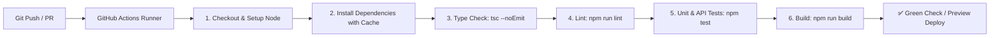

# App CI/CD & Pipeline Automation Skill

This skill guides the agent in setting up automated Continuous Integration and Continuous Deployment (CI/CD) pipelines. For a solo developer, an automated CI pipeline functions as a tireless gatekeeper, ensuring every Git push or Pull Request passes type checks, linting, security audits, and tests before production deployment.

---

## Core CI/CD Architecture



---

## Workflow Steps

### Step 1: GitHub Actions CI Pipeline Setup
Create `.github/workflows/ci.yml`:

```yaml
name: CI Pipeline

on:
  push:
    branches: [ main, dev ]
  pull_request:
    branches: [ main, dev ]

concurrency:
  group: ${{ github.workflow }}-${{ github.ref }}
  cancel-in-progress: true

jobs:
  validate:
    name: Lint, Typecheck & Test
    runs-on: ubuntu-latest
    timeout-minutes: 15

    steps:
      - name: Checkout Code
        uses: actions/checkout@v4

      - name: Setup Node.js
        uses: actions/setup-node@v4
        with:
          node-version: 20
          cache: 'npm'

      - name: Install Dependencies
        run: npm ci

      - name: Type Check
        run: npx tsc --noEmit

      - name: Lint Check
        run: npm run lint

      - name: Run Tests
        run: npm test -- --coverage
        env:
          CI: true

      - name: Build Application
        run: npm run build
        env:
          NODE_ENV: production
```

---

### Step 2: Automated Dependency Updates (Dependabot)
Create `.github/dependabot.yml`:

```yaml
version: 2
updates:
  - package-ecosystem: "npm"
    directory: "/"
    schedule:
      interval: "weekly"
    open-pull-requests-limit: 5
    reviewers:
      - "${{ github.actor }}"
    commit-message:
      prefix: "chore(deps)"
```

---

### Step 3: Git Branch & Pull Request Protection Strategy
Recommend or enforce standard branching practices:
1. **`main`**: Production-ready branch. Direct pushes should be protected; merges occur only via clean PRs or tagged releases.
2. **`dev`**: Staging/integration branch for continuous testing.
3. **`feat/<feature-name>`**, **`fix/<bug-name>`**: Short-lived feature branches created for specific tasks.

---

### Step 4: Preview & Staging Deployments
Configure automated deployment integrations:
1. **Vercel / Netlify**: Connect GitHub repository so preview environments are generated automatically for every Pull Request.
2. **Docker Hub / GitHub Container Registry (GHCR)**: Add automated container build workflow if containerized deployment is requested:
   ```yaml
   name: Docker Build
   on:
     push:
       branches: [ main ]
   jobs:
     docker:
       runs-on: ubuntu-latest
       steps:
         - uses: actions/checkout@v4
         - name: Build Docker Image
           run: docker build -t app:latest .
   ```

---

### Step 5: Verification & Delivery Report
1. Verify YAML syntax and indentation in `.github/workflows/ci.yml`.
2. Ensure all scripts referenced in the workflow (`lint`, `test`, `build`) exist in `package.json`.
3. Provide summary report to developer:
```markdown
## 🚀 CI/CD Pipeline Established

- **Pipeline File**: `.github/workflows/ci.yml`
- **Automation Triggers**: Pushes & PRs to `main` and `dev`
- **Gates Enforced**:
  - ✅ Clean dependency installation (`npm ci`)
  - ✅ TypeScript static type checking (`tsc --noEmit`)
  - ✅ ESLint style and quality gate (`npm run lint`)
  - ✅ Automated test suite execution (`npm test`)
  - ✅ Production build verification (`npm run build`)
- **Dependabot Config**: `.github/dependabot.yml` (weekly security updates)
```

---

## Error Handling & Fallbacks

If any step in this CI/CD setup or execution fails:
1. **`npm ci` failure**: Ensure `package-lock.json` is committed and synchronized with `package.json`. Run `npm install` locally and commit lockfile changes.
2. **Action Timeout / Resource Limit**: Add `timeout-minutes: 15` and ensure cache keys are scoped properly to prevent redundant package downloads.
3. **Environment Secrets**: If tests require environment variables, inject dummy test secrets into the workflow via `env:` block (e.g. `JWT_SECRET: test-secret`).
4. **Escalate**: If GitHub runner fails on unfamiliar environment issues, present the raw workflow step logs to the developer.
