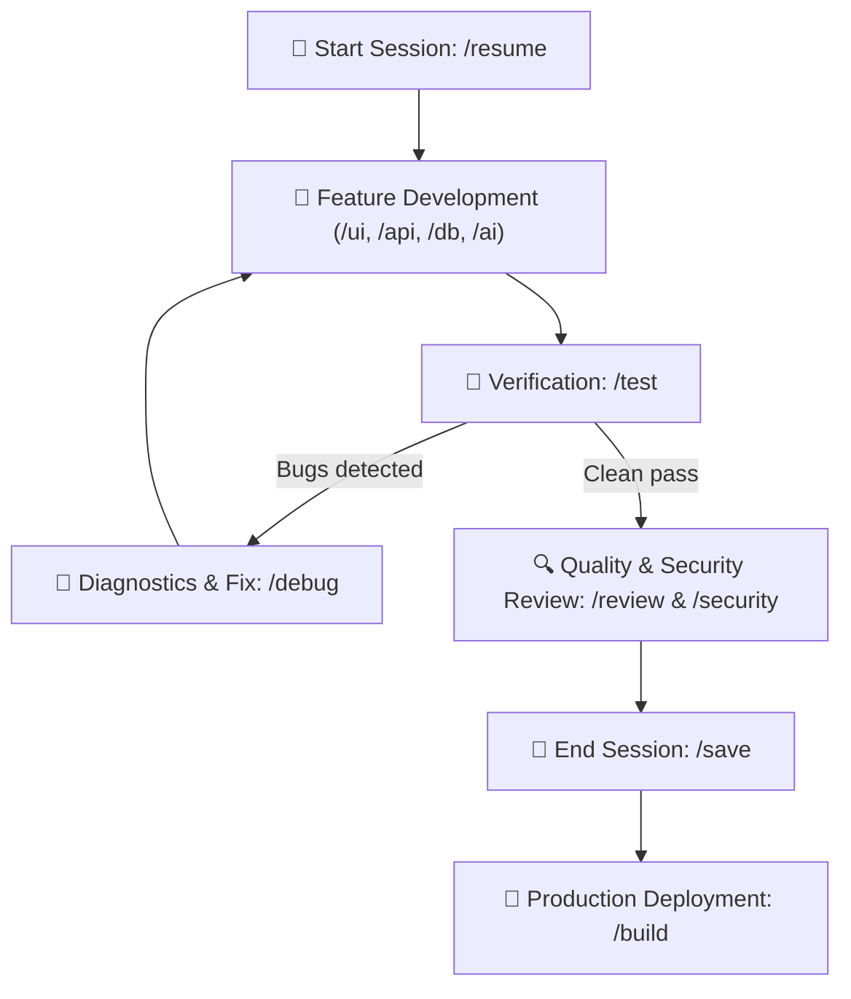

# AGENTS.md – Fullstack Application Agent Guidelines (Solo Dev Kit)

This repository is a professional **Fullstack Web Application** development template and cognitive environment optimized for **seamless collaboration between a solo developer and an AI coding agent**.

---

## 🎯 Core Operating Principles for the Agent

1. **Single Source of Truth**:
   - All persistent project data, architecture, product requirements, styling tokens, and status reside in `.agents/blueprint/`.
   - Never make assumptions about features or requirements without checking `.agents/blueprint/PRD.md`.
   - All UI components, buttons, and colors must strictly adhere to `.agents/blueprint/STYLE_GUIDE.md`.
   - All security standards and audit findings reference `.agents/blueprint/SECURITY_AUDIT.md`.
2. **Engineering Standards**:
   - Always follow `.agents/rules/fullstack-dev.md`.
   - Clean, modular architecture with clear separation of concerns (frontend, backend, data layer).
   - Security-first mindset: no secrets in code, validated inputs (Zod), proper auth flows.
   - Accessible, responsive, and performant UI (WCAG 2.1 AA & Core Web Vitals compliant).
   - Structured, streaming-first AI integration with token cost safeguards.
3. **Context and Token Management**:
   - Keep sessions focused and compact.
   - When the developer ends the session, execute `/save` (`app-memory`).
   - When starting a fresh session, execute `/resume` (`app-memory`) and read only the 2–4 key files specified in `SESSION_STATE.md`.

---

## ⚡ Slash Commands & Skills Mapping

The agent must activate the corresponding skill (`.agents/skills/<skill-name>/SKILL.md`) when the user invokes these commands or requests the corresponding task:

### Lifecycle & Quality Commands
| Command | Skill | Purpose |
| :--- | :--- | :--- |
| `/resume`, `/start-session` | `app-memory` | Session start: read state and deliver a concise 3-sentence kick-off debrief |
| `/init` | `app-init` | Initialize new app: *Grill-Me* interview, PRD & blueprint creation, project scaffold |
| `/onboard`, `/audit` | `app-onboard` | Audit and reverse-engineer existing codebase, build blueprint |
| `/review`, `/optimize` | `app-review` | Code quality assurance: performance, a11y, SEO, architecture audit |
| `/test` | `app-test` | Automated browser testing: page load, navigation, forms, console errors, responsive |
| `/test-unit`, `/unit-test` | `app-test-unit` | Automated unit & integration testing: Vitest/Jest, API tests, coverage reporting |
| `/ci`, `/pipeline` | `app-ci` | CI/CD pipeline setup: GitHub Actions, automated checks, PR gates, Dependabot |
| `/docs`, `/doc` | `app-docs` | Studio documentation suite: Standard README, CHANGELOG, RUNBOOK, API docs, ADRs |
| `/debug`, `/fix` | `app-debug` | Systematic diagnostics: root cause analysis, fix proposal, `KNOWN_BUGS.md` logging |
| `/save`, `/checkpoint` | `app-memory` | Session end: summarize state, define next task, save handoff context |
| `/build`, `/deploy` | `app-deploy` | Production build, deployment packaging (Vercel, Netlify, Docker, GitHub Pages) |

### Specialized Domain Commands
| Command | Skill | Purpose |
| :--- | :--- | :--- |
| `/ui`, `/component` | `app-ui` | Build accessible, responsive UI components strictly adhering to `STYLE_GUIDE.md` |
| `/api`, `/endpoint` | `app-api` | Standardized API routes: Zod input validation, uniform error envelopes, auth checks |
| `/db`, `/database` | `app-db` | Database engineering: schemas, relations, indexes, migrations, and seed data |
| `/ai`, `/llm` | `app-ai` | Production AI integration: streaming, structured Zod outputs, prompt management |
| `/email` | `app-email` | Transactional email systems: React Email templates, Resend/SendGrid, SPF/DKIM |
| `/perf`, `/optimize-perf` | `app-perf` | Performance & Core Web Vitals optimization: bundle analysis, Lighthouse, caching |
| `/security`, `/sec-audit` | `app-security` | Comprehensive OWASP Top 10 security audit, CVE scan, and `SECURITY_AUDIT.md` logging |

---

## 🔄 The Solo Developer Loop

