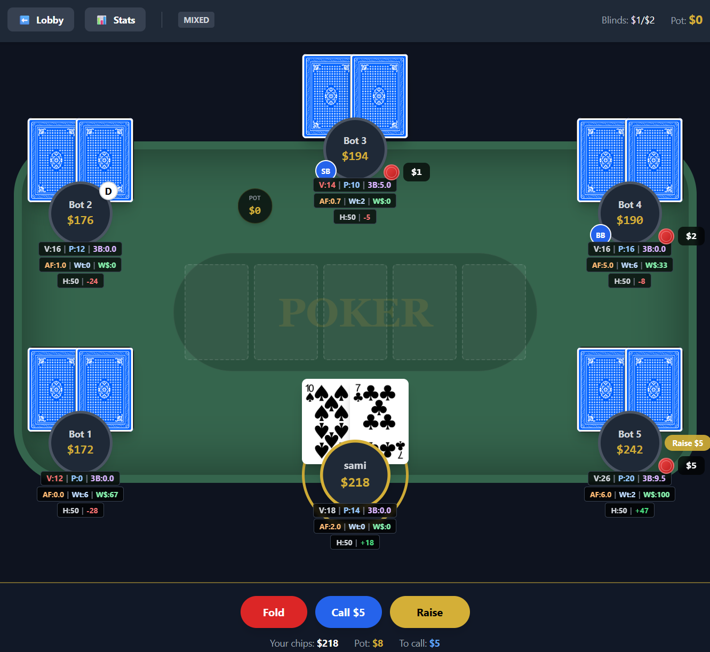

# 🃏 Poker Trainer

A 6-max No-Limit Hold'em poker training simulator with intelligent AI opponents. Built as a portfolio project to demonstrate React, TypeScript, and game AI development skills.



---

## � About

This is a **Showcase Project** where you can practice against AI opponents with distinct playing styles. The bots use position-aware strategies and adapt to your playstyle over time.

**Built with:** React 18 • TypeScript • Vite • TailwindCSS

---

## ✨ Features

### Gameplay
- 6-player No-Limit Hold'em cash game
- Realistic betting mechanics (min-raise, all-in, side pots)
- Position-based hand ranges

### AI Opponents
| Bot Type | Personality | Playstyle |
|----------|-------------|-----------|
| Beginner | Fish | Loose-Passive, calls too much |
| Intermediate | Nit | Tight-Passive, only premium hands |
| Advanced | TAG | Tight-Aggressive, balanced |
| Pro | LAG | Loose-Aggressive, bluffs frequently |

### Stats & HUD
- VPIP (Voluntarily Put $ In Pot)
- PFR (Pre-Flop Raise %)
- 3-Bet%, Aggression Factor
- Session profit/loss tracking

---

## 🚀 Quick Start

```bash
# Install dependencies
npm install

# Start development server
npm run dev

# Build for production
npm run build
```

Open `http://localhost:5173` and enter any username to start playing.

> ⚠️ **Note:** This app uses a **demo login system**—no real authentication. Just type any username (e.g., "Player1") and click Enter. Your session data is saved locally in your browser.

---

## 🛠️ Tech Stack

- **Frontend:** React 18, TypeScript
- **Styling:** TailwindCSS 3.4
- **Build:** Vite 5
- **State:** React Context + LocalStorage
- **Charts:** Recharts

---

##  Project Structure

```
src/
├── components/    # UI components (Table, Cards, Controls)
├── game/          # Game engine (BotLogic, PokerGame, HandEvaluator)
├── pages/         # Page views (Login, Home, Game)
├── context/       # State management
├── services/      # Data persistence
└── utils/         # Helpers (SoundManager)
```

---

## 🎮 How to Play

1. Enter a username on the login screen
2. Select a table type (Beginner, Mixed, Advanced, Pro)
3. Play poker! Use the controls to Fold, Call, Check, or Raise
4. Watch the HUD stats to learn opponent tendencies

---

## 📝 Future Plans

This is the free portfolio version. A paid Pro version with advanced features is planned:
- Hand replayer with pot odds display
- Leak finder (automated analysis)
- Multi-table support
- Tournament mode

---

## 📜 License & Usage

This repository is primarily a **Showcase** of my technical skills and architectural capability.
While the code is public to demonstrate code quality:

1.  **Strictly Personal:** The design, copy, and specific implementation details are tailored to my personal brand.
2.  **No License for Reuse:** Please do not fork, copy, or deploy this site as your own portfolio or application.
3.  **Inquiries:** For business inquiries or collaboration, please contact me via LinkedIn.

---

*This project was built as a demonstration of web game development skills. Feel free to explore the code!*
