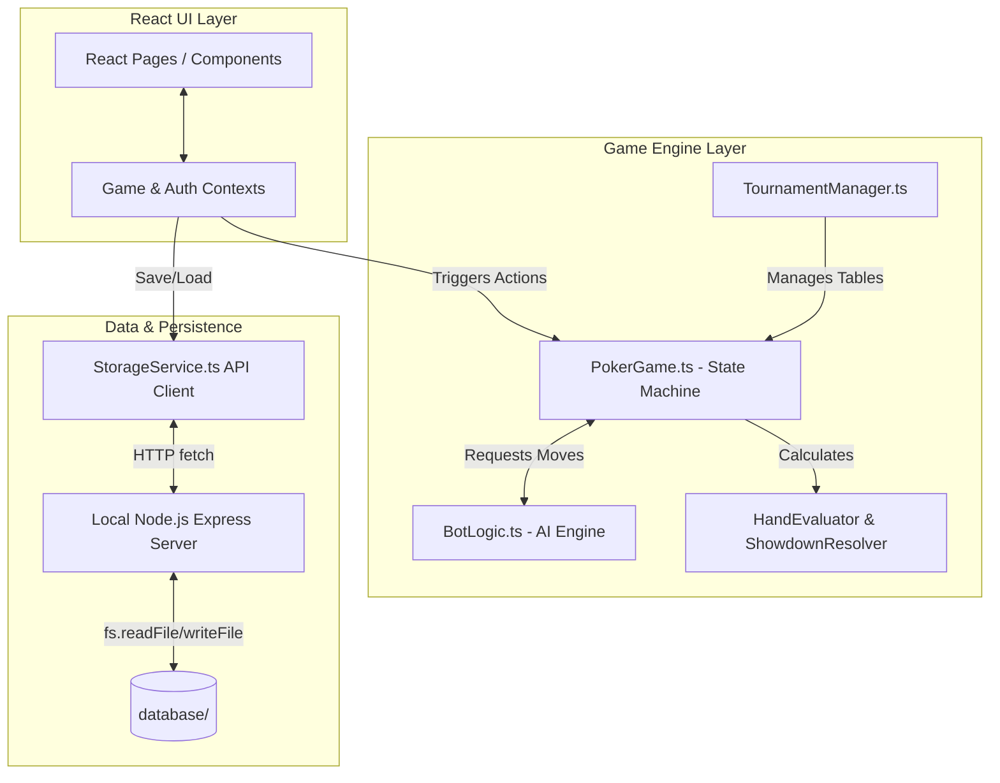

# 🃏 Poker Analytics Engine

A No-Limit Hold'em simulator with an AI coaching layer. Combines a browser-based poker game engine with a cloud LLM for hand analysis and leak detection.

[](https://opensource.org/licenses/MIT)
[](https://www.typescriptlang.org/)
[](https://reactjs.org/)
[](https://vitejs.dev/)

---

## 📋 Table of Contents

- [About](#-about)
- [Features](#-features)
- [Tech Stack](#️-tech-stack)
- [Getting Started](#-getting-started)
- [Project Structure](#-project-structure)
- [Game Engine Architecture](#-game-engine-architecture)
- [AI Bot System](#-ai-bot-system)
- [Testing](#-testing)
- [Roadmap](#-roadmap)
- [License](#-license)

---

## 🎯 About

**Poker Analytics Engine** is a training and analysis platform combining a realistic NLHE simulator with an AI coaching layer.

Core features:
- **Deterministic Pre-computation** — hand strength, action types, and board texture are classified locally before being sent to the LLM, reducing hallucinations
- **Context-window engineering** — the LLM receives structured, verified facts rather than raw game state
- **Full-stack architecture** — TypeScript game engine, Node.js/Express backend, React UI
- **Statistical HUD** — real-time opponent profiling (VPIP, PFR, AF, 3-Bet%, and more)

**Built with:** React 18 • TypeScript • Vite • TailwindCSS • Node.js • OpenRouter

---

## ✨ Features

### 🎮 Gameplay
- **Cash Games & Tournaments (MTT)** simulation up to 50 players
- **Dynamic table sizes** supporting 6-max up to 9-max seating
- **Realistic betting mechanics** including min-raise, all-in, and side pot calculations
- **Position-based hand ranges** (UTG tight, BTN wide)
- **Blind structure** with automatic dealer button rotation and tournament blind escalation
- **Buy-in system** for rebuy functionality (cash games)
- **Sound effects & animations**

### 🤖 AI Opponents

Four distinct bot personalities with different playing styles:

| Bot Type | Personality | VPIP | PFR | Playstyle |
|----------|-------------|------|-----|-----------|
| **Beginner** | Fish | 45-60% | 10-15% | Loose-Passive, calls too much, rarely raises |
| **Intermediate** | Nit | 15-20% | 12-16% | Tight-Passive, only premium hands |
| **Advanced** | TAG | 20-25% | 18-22% | Tight-Aggressive, balanced and positional |
| **Pro** | LAG | 28-35% | 22-28% | Loose-Aggressive, bluffs frequently, exploitative |

**AI Features:**
- Position-aware pre-flop ranges
- Board texture analysis (dry/wet boards)
- Dynamic continuation betting
- Opponent profiling and adaptation (15-hand sample)
- Stack-depth adjustments
- Polarized 3-betting ranges
- Floating and delayed c-bets

### 📊 Stats & HUD

Real-time poker statistics displayed for each player:
- **VPIP** (Voluntarily Put $ In Pot)
- **PFR** (Pre-Flop Raise %)
- **3-Bet %** (3-bet frequency)
- **Aggression Factor** (bet/raise vs call ratio)
- **Hands Played** counter
- **M-Ratio** tracking (color-coded stack health)
- **Positional statistics** breakdown

### 📥 Hand History Import

- **PokerStars hand history parser**
- Drag & drop or paste interface
- Automatic hand metadata extraction
- Session data merging with local stats

### 📈 Analytics Dashboard & Leakfinder

- **Global Leakfinder view** aggregating lifetime data
- **Positional Statistics Matrix** (VPIP/PFR/ATS per position)
- **C-Bet drop-off charts** (Flop vs Turn vs River)
- **Showdown Math alerts** (WTSD% vs W$SD, W$WSF)
- **Session performance graphs** with Recharts
- **Profit/loss tracking** over time
- **Hand history viewer** with detailed breakdowns
- **Export functionality** for session data

### 🧠 AI Poker Coach (OpenRouter)

- **Cloud LLM integration** via OpenRouter (Claude 3.5 Sonnet)
- **Session Review** — AI analyzes hands and highlights mistakes in preflop decisions, sizing, etc.
- **Global Leak Finder** — data-driven analysis of lifetime stats using HUD metrics (Fold to 3-Bet, Fold to C-Bet, W$WSF, AF, etc.)
- **Deterministic Pre-computation** — hand strength, action types, and opponent profiles are classified locally before LLM injection, reducing token usage and hallucinations

> **Note:** Originally built on **Ollama** for local inference. Pivoted to **OpenRouter** for access to larger models. The game engine remains 100% local; only LLM calls are cloud-routed.

### 💾 Secure Backend System

- **Express.js API**: Built-in backend server running on Node.js to persist data securely.
- **Stateless Authentication**: Uses JWT (JSON Web Tokens) to verify users and protect routes from unauthorized access.
- **Strict Validation**: All API inputs are rigorously validated at runtime using `Zod` schemas.
- **Local JSON Database**: Player stats, hands, and sessions are cleanly organized into `database/<username>/cash/sessions/` directories.

---

## 🛠️ Tech Stack

### Frontend
- **React 18.2** - UI framework with hooks
- **TypeScript 5.2** - Type-safe development
- **React Router 7.10** - Multi-page navigation
- **TailwindCSS 3.4** - Utility-first styling
- **Recharts 3.5** - Data visualization

### Backend & Database
- **Node.js** & **Express** - Local API server
- **fs (File System)** - Local JSON database (organized by player and mode)
- **OpenRouter API** - Cloud LLM routing for the AI Coach

### Build Tools
- **Vite 5.0** - Lightning-fast build tool
- **ESLint 8.55** - Code linting
- **PostCSS 8.4** - CSS processing
- **Vitest 4.0** - Unit testing framework

### State Management
- **React Context API** - Global state (Auth, Game)
- **API Fetch** - Async communication with local backend
- **Custom hooks** - Reusable logic

### Utilities
- **clsx** - Conditional class names
- **tailwind-merge** - Tailwind class merging

---

## 🚀 Getting Started

### Prerequisites

- **Node.js** 18.x or higher
- **npm** 9.x or higher

### Installation

```bash
# Clone the repository
git clone https://github.com/yourusername/poker-trainer.git
cd poker-trainer

# Install dependencies
npm install

# Copy environment variables template
cp .env.example .env

# Open .env and add your OpenRouter API key:
# OPENROUTER_API_KEY=your_key_here

# Start development server
npm run dev
```

The app will be available at `http://localhost:5173`

### Available Scripts

```bash
# Development server (Starts BOTH React and Node.js backend concurrently)
npm run dev

# Build for production
npm run build

# Preview production build
npm run preview

# Run tests
npm test

# Run linter
npm run lint
```

### First-Time Setup

1. Open `http://localhost:5173` in your browser
2. Click **Register** on the login screen to create a new profile with a password.
3. Select a table type:
   - **Beginner** - All Fish bots
   - **Mixed** - Variety of skill levels
   - **Advanced** - All TAG bots
   - **Pro** - All LAG bots
4. Start playing!

> ⚠️ **Note:** The data is securely saved locally on your computer inside the `server/database/` folder. Your stats are safe even if you clear your browser cache!

---

## 📁 Project Structure

```
poker-app/
├── src/
│   ├── components/              # React UI components
│   │   ├── Card.tsx
│   │   ├── Controls.tsx
│   │   ├── FinalTableAnnouncement.tsx
│   │   ├── GameOverScreen.tsx
│   │   ├── HandDetailsModal.tsx
│   │   ├── PokerTable.tsx
│   │   ├── PositionalStatsTable.tsx
│   │   ├── Seat.tsx
│   │   ├── SessionDashboard.tsx
│   │   └── ShowdownOverlay.tsx
│   │
│   ├── game/                    # Game engine core
│   │   ├── BoardAnalyzer.ts          # Board texture analysis
│   │   ├── BoardAnalyzer.test.ts
│   │   ├── BotLogic.ts               # AI decision engine
│   │   ├── BotLogic.test.ts
│   │   ├── bot/                      # Bot strategy modules
│   │   ├── Deck.ts                   # Card deck management
│   │   ├── HandEvaluator.ts          # Poker hand ranking
│   │   ├── HandEvaluator.test.ts
│   │   ├── OpponentProfiler.ts       # Player tendency tracking
│   │   ├── OpponentProfiler.test.ts
│   │   ├── PokerGame.ts              # Main game state machine
│   │   ├── ShowdownResolver.ts       # Pot distribution
│   │   ├── TournamentManager.ts      # MTT management
│   │   └── types.ts                  # TypeScript interfaces
│   │
│   ├── pages/                   # Route pages
│   │   ├── CoachPage.tsx        # AI Coach interface
│   │   ├── GamePage.tsx         # Main poker game
│   │   ├── HomePage.tsx         # Table selection
│   │   ├── ImportPage.tsx       # Hand history import
│   │   ├── LoginPage.tsx        # User authentication
│   │   └── StatisticsPage.tsx   # Analytics & leakfinder
│   │
│   ├── context/                 # React Context providers
│   │   └── AuthContext.tsx
│   │
│   ├── hooks/                   # Custom React hooks
│   │
│   ├── layouts/                 # Layout components
│   │
│   ├── services/                # Data services
│   │   ├── CoachService.ts
│   │   └── StorageService.ts
│   │
│   ├── utils/                   # Utility functions
│   │   ├── HandHistoryParser.ts
│   │   ├── SoundManager.ts
│   │   └── cn.ts
│   │
│   ├── App.tsx
│   ├── main.tsx
│   └── index.css
│
├── server/                      # Node.js/Express backend
│   └── database/                # Local JSON storage
│
├── public/                      # Static assets
├── dist/                        # Production build output
├── CHANGELOG.md
├── SECURITY.md
├── package.json
├── tsconfig.json
├── vite.config.ts
├── tailwind.config.js
└── README.md
```

---

## 🎲 Game Engine Architecture


```mermaid
graph TD
    %% UI Layer
    subgraph UI_Layer [React UI Layer]
        Pages[React Pages / Components]
        State[Game & Auth Contexts]
        Pages <--> State
    end

    %% Logic Layer
    subgraph Logic_Layer [Game Engine Layer]
        Game[PokerGame.ts - State Machine]
        Bots[BotLogic.ts - AI Engine]
        Rules[HandEvaluator & ShowdownResolver]
        TM[TournamentManager.ts]
        
        State -->|Triggers Actions| Game
        Game <-->|Requests Moves| Bots
        Game -->|Calculates| Rules
        TM -->|Manages Tables| Game
    end

    %% Data Layer
    subgraph Data_Layer [Data & Persistence]
        Storage[StorageService.ts API Client]
        Server[Local Node.js Express Server]
        JSON[(database/)]
        
        State -->|Save/Load| Storage
        Storage <-->|HTTP fetch| Server
        Server <-->|fs.readFile/writeFile| JSON
    end
```

### Core Components

#### 1. **PokerGame.ts** - Game State Machine
The central game engine managing:
- **Hand lifecycle** (pre-flop → flop → turn → river → showdown)
- **Betting rounds** with action validation
- **Pot management** including side pots
- **Player state** (active, folded, all-in)
- **Dealer button rotation**
- **Blind posting** (SB/BB)

**Key Methods:**
```typescript
startNewHand()           // Initialize new hand
handleAction()           // Process player actions
nextTurn()               // Advance to next player
nextPhase()              // Move to next betting round
```

#### 2. **ShowdownResolver.ts** - Hand Resolution
Extracted logic from the main game loop to handle showdowns:
- **Winner determination** in multi-way pots
- **Pot distribution** and side pots
- **Session analytics logging**

#### 3. **HandEvaluator.ts** - Hand Ranking System
Evaluates 7-card combinations (2 hole + 5 community) to determine:
- Hand rank (High Card → Royal Flush)
- Kicker cards for tie-breaking
- Winner determination in multi-way pots

**Supported Hand Rankings:**
1. Royal Flush
2. Straight Flush
3. Four of a Kind
4. Full House
5. Flush
6. Straight
7. Three of a Kind
8. Two Pair
9. One Pair
10. High Card

#### 3. **BoardAnalyzer.ts** - Texture Analysis
Analyzes community cards for:
- **Board wetness** (coordinated vs dry)
- **Flush draws** (suited cards)
- **Straight draws** (connected ranks)
- **Paired boards**
- **High card strength**

Used by AI to adjust betting strategies.

#### 5. **Deck.ts** - Card Management
- 52-card deck initialization
- Fisher-Yates shuffle algorithm
- Card dealing and tracking

---

## 🤖 AI Bot System

### Decision-Making Architecture

The `BotLogic.ts` module implements a sophisticated decision tree using a **Strategy Pattern** for different difficulty levels (`BeginnerStrategy`, `IntermediateStrategy`, `AdvancedStrategy`, `ProStrategy`):

```
decide()
  ├── Pre-Flop Decision
  │   ├── Position evaluation (UTG/HJ/CO/BTN/SB/BB)
  │   ├── Hand strength calculation
  │   ├── Stack depth consideration
  │   └── Action history analysis
  │
  └── Post-Flop Decision
      ├── Board texture analysis
      ├── Hand equity estimation
      ├── Pot odds calculation
      ├── Opponent profiling
      └── Betting pattern recognition
```

### Bot Difficulty Levels

#### **Beginner (Fish)**
- Calls with weak hands (any pair, any ace)
- Rarely raises or bluffs
- Ignores position
- Chases draws without pot odds
- VPIP: 45-60%, PFR: 10-15%

#### **Intermediate (Nit)**
- Only plays premium hands (JJ+, AK, AQ)
- Position-aware but passive
- Rarely bluffs
- Folds to aggression
- VPIP: 15-20%, PFR: 12-16%

#### **Advanced (TAG)**
- Tight-aggressive strategy
- Position-based opening ranges
- Continuation betting
- Board texture awareness
- Balanced value/bluff ratio
- VPIP: 20-25%, PFR: 18-22%

#### **Pro (LAG)**
- Loose-aggressive strategy
- Wide opening ranges from late position
- Frequent 3-betting and 4-betting
- Advanced bluffing on wet boards
- Exploitative adjustments
- Stack-depth manipulation
- VPIP: 28-35%, PFR: 22-28%

### Opponent Profiling

The `OpponentProfiler.ts` tracks:
- VPIP (Voluntarily Put $ In Pot)
- PFR (Pre-Flop Raise %)
- 3-Bet frequency
- Aggression factor
- Showdown tendencies

Bots adapt after 50-hand sample size.

---

## 🧪 Testing

### Test Coverage

The project includes comprehensive unit tests:

```bash
# Run all tests
npm test

# Run tests in watch mode
npm test -- --watch

# Run tests with coverage
npm test -- --coverage
```

### Test Files

- `BoardAnalyzer.test.ts` - Board texture analysis
- `BotLogic.test.ts` - AI decision-making
- `HandEvaluator.test.ts` - Hand ranking system
- `OpponentProfiler.test.ts` - Player profiling

**Example Test:**
```typescript
describe('HandEvaluator', () => {
  it('should identify a Royal Flush', () => {
    const cards = [
      { rank: 'A', suit: 'hearts' },
      { rank: 'K', suit: 'hearts' },
      { rank: 'Q', suit: 'hearts' },
      { rank: 'J', suit: 'hearts' },
      { rank: '10', suit: 'hearts' }
    ];
    const result = HandEvaluator.evaluate(cards);
    expect(result.rank).toBe('Royal Flush');
  });
});
```

---

## 🚀 Deployment

### Production Build

```bash
# Build optimized production bundle
npm run build

# Preview production build locally
npm run preview
```

The production build will be output to the `dist/` directory.

### Deployment Options

#### **Option 1: itch.io (Recommended for Free Version)**
1. Add `base: './'` to `vite.config.ts`
2. Run `npm run build`
3. Zip contents of `dist/` folder
4. Upload to itch.io as HTML5 game
5. Set viewport to 1280x720

#### **Option 2: Vercel/Netlify**
```bash
# Deploy to Vercel
vercel --prod

# Deploy to Netlify
netlify deploy --prod
```

#### **Option 3: GitHub Pages**
```bash
# Build with correct base path
npm run build -- --base=/poker-trainer/

# Deploy to gh-pages branch
npm run deploy
```


---

## 🗺️ Roadmap

### ✅ Completed (v1.3.0)
- [x] Multi-Table Tournament (MTT) support with up to 50 players
- [x] Dynamic seating for 6-max, 7-max, 8-max, and 9-max tables
- [x] Stack-to-Blind Ratio (SBR) push/fold logic for AI
- [x] Session analytics dashboard
- [x] Hand history import (PokerStars)
- [x] Position-based AI strategies
- [x] Board texture analysis
- [x] Opponent profiling
- [x] Advanced HUD (3-Bet%, AF, WTSD, W$SD, W$WSF, Fold to Steal/3-Bet/C-Bet)
- [x] Profit/loss graphs (EV, Showdown, Non-Showdown)
- [x] Hand action log and details modal
- [x] Leak finder with automated analysis (C-Bet drop-offs, Showdown Math, Positional Matrix)
- [x] AI Poker Coach with OpenRouter LLM integration for Session Reviews

### 🔄 In Progress (v1.4.0)
- [ ] Hand database with search/filter

### 🔮 Future Plans (v2.0+)
- [ ] GTO solver integration (Rust + WebAssembly)
- [ ] Pre-flop range charts
- [ ] Mobile app (React Native)
- [ ] Cloud sync (optional)


---

## 🤝 Contributing

1. Fork the repository
2. Create a feature branch: `git checkout -b feature/my-feature`
3. Make your changes
4. Run tests: `npm test`
5. Run linter: `npm run lint`
6. Commit: `git commit -m 'feat: add my feature'`
7. Push and open a Pull Request

### Commit Convention

Uses [Conventional Commits](https://www.conventionalcommits.org/):

- `feat:` — new feature
- `fix:` — bug fix
- `docs:` — documentation
- `refactor:` — code refactoring
- `test:` — test additions or changes
- `chore:` — build or tooling changes

---

## 📜 License

MIT License — see [LICENSE](LICENSE) for details.

---

## 🙏 Acknowledgments

- Hand evaluation algorithm inspired by Cactus Kev's evaluator
- UI design inspired by PokerStars and GGPoker
- Poker math concepts from *The Mathematics of Poker* by Chen & Ankenman
